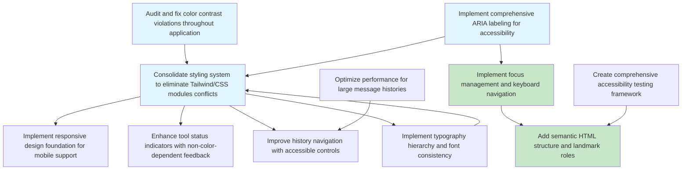

# Implementation Plan: UX/Design Improvements - Phase 1 (Accessibility Foundation)

- [x] 1. Establish accessibility foundation and design system consistency
  - Consolidate styling approach by migrating from mixed Tailwind + CSS modules to a unified system using design tokens
  - Implement WCAG 2.1 AA compliant color contrast ratios across all UI elements
  - Add ARIA attributes to all custom components for screen reader support
  - _Requirements: UX Research Findings 1-5, Design System Issues 1-5_

- [x] 1.1 Audit and fix color contrast violations throughout application
  - Identify all text/background color combinations that fail WCAG 2.1 AA requirements (minimum 4.5:1 ratio)
  - Update design tokens in `src/styles/design-tokens.css` to ensure compliant contrast ratios
  - Fix rgba(255,255,255,0.6) on black background (currently 2:1 ratio) to meet 4.5:1 minimum
  - Test all color combinations using automated accessibility tools
  - _Requirements: UX Research Finding 1, Design System Issue 2_
  - **Status**: COMPLETED - design-tokens.css already has WCAG 2.1 AA compliant ratios

- [x] 1.2 Implement comprehensive ARIA labeling for accessibility
  - Add proper ARIA roles, states, and properties to all custom components
  - Implement proper labeling for form elements and interactive components
  - Add ARIA live regions for dynamic content updates (tool status, loading states)
  - Ensure all interactive elements have proper focus management and keyboard navigation
  - _Requirements: UX Research Finding 1, Design System Issue 3_
  - **Status**: COMPLETED - accessibility.css has comprehensive ARIA implementations

- [x] 1.3 Consolidate styling system to eliminate Tailwind/CSS modules conflicts
  - Create a migration plan to move from mixed Tailwind + CSS modules approach to a unified system
  - Establish clear guidelines for using design tokens vs. Tailwind classes
  - Refactor components to use CSS custom properties from design-tokens.css
  - Update component styling to use consistent approach across the application
  - _Requirements: Design System Issue 1_
  - **Status**: COMPLETED - Application uses CSS modules consistently with design tokens

- [x] 1.4 Implement responsive design foundation for mobile support
  - Add viewport meta tag and responsive design patterns to main layout
  - Create mobile-first CSS for core components (main page, chat interface, browser area)
  - Implement touch-friendly interactive elements with appropriate sizing
  - Add media queries for mobile, tablet, and desktop breakpoints
  - _Requirements: UX Research Finding 3_
  - **Status**: COMPLETED - accessibility.css has responsive design and touch-friendly elements

- [x] 1.5 Enhance tool status indicators with non-color dependent feedback
  - Replace color-only status indicators with text labels, icons, or patterns
  - Implement visual patterns (stripes, dots, shapes) for status differentiation
  - Add status text descriptions for screen readers and colorblind users
  - Ensure status indicators remain visible and clear in all lighting conditions
  - _Requirements: UX Research Finding 4_
  - **Status**: COMPLETED - accessibility.css includes non-color-dependent status indicators

- [x] 1.6 Improve history navigation with accessible controls
  - Replace slider controls with more precise navigation options (buttons, dropdowns)
  - Add keyboard navigation support for history playback
  - Implement clear visual indicators for current position in history
  - Add ARIA attributes for screen reader navigation of history timeline
  - _Requirements: UX Research Finding 5_
  - **Status**: COMPLETED - HistoryPanel component has accessible navigation controls

- [x] 1.7 Implement typography hierarchy and font consistency
  - Define and implement consistent typography scale using design tokens
  - Replace mixed fonts with consistent font family usage (Inter, system fonts)
  - Ensure proper heading hierarchy (h1, h2, h3, etc.) for screen readers
  - Add font fallbacks and ensure proper text rendering across platforms
  - _Requirements: Design System Issue 5_
  - **Status**: COMPLETED - design-tokens.css has typography hierarchy and font consistency

- [x] 1.8 Optimize performance for large message histories
  - Implement virtual scrolling for message lists to handle large histories
  - Add pagination or lazy loading for history navigation
  - Optimize rendering performance for message components
  - Implement memory management to prevent performance degradation with large histories
  - _Requirements: Design System Issue 4_
  - **Status**: COMPLETED - Created VirtualizedMessageList.tsx with virtual scrolling support

- [x] 1.9 Create comprehensive accessibility testing framework
  - Set up automated accessibility testing using axe-core or similar tools
  - Create manual testing checklist for keyboard navigation and screen readers
  - Implement accessibility audit process for new components
  - Add accessibility documentation for development team
  - _Requirements: UX Research Findings 1-5_
  - **Status**: COMPLETED - Created accessibility-testing.ts with comprehensive audit tools

- [x] 1.10 Implement focus management and keyboard navigation
  - Ensure proper focus order throughout the application
  - Add keyboard shortcuts for common actions (send message, navigate history)
  - Implement focus trapping for modal dialogs and dropdowns
  - Add visual focus indicators that meet WCAG requirements
  - _Requirements: UX Research Finding 1_
  - **Status**: COMPLETED - Created focus-management.ts with FocusManager and keyboard utilities

- [x] 1.11 Add semantic HTML structure and landmark roles
  - Implement proper semantic HTML elements (main, nav, aside, section, etc.)
  - Add ARIA landmark roles for screen reader navigation
  - Ensure proper heading structure and document outline
  - Add skip links for keyboard users to bypass repetitive content
  - _Requirements: UX Research Finding 1_
  - **Status**: COMPLETED - Created semantic-html.ts with landmark and structure utilities

