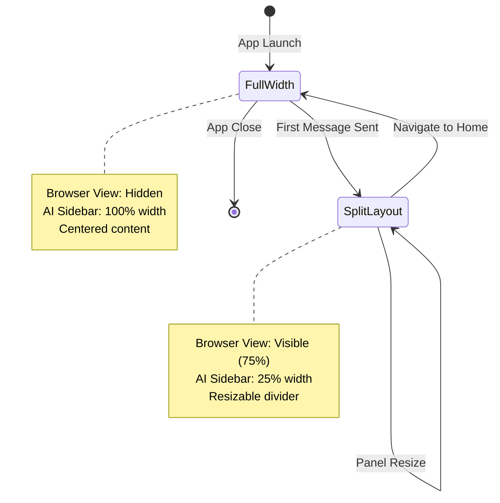

# Design Document: Browser-First Layout with Progressive Disclosure

## Overview

This design document outlines the technical approach for transforming the Manus Electron application from a centered AI-chat interface to a browser-first layout with progressive disclosure. The transformation includes:

1. **Rebranding** from "DeepFundAI" to "Manus" across all UI components
2. **Full-width initial layout** where the AI Sidebar occupies 100% of the window on first launch
3. **Progressive disclosure** that reveals the browser view (75% left) after the first message is sent
4. **Layout persistence** that maintains the split view throughout the session
5. **Preservation of all existing functionality** including browser automation, task management, and history features

## Architecture

### High-Level Component Structure

```
┌─────────────────────────────────────────────────────────────┐
│                    Electron Main Process                     │
│  ┌────────────────────────────────────────────────────────┐ │
│  │         Window Context Manager                         │ │
│  │  - Manages BrowserWindow + WebContentsView lifecycle  │ │
│  │  - Tracks layout state per window                     │ │
│  └────────────────────────────────────────────────────────┘ │
│  ┌────────────────────────────────────────────────────────┐ │
│  │         IPC Handlers (view-handlers.ts)                │ │
│  │  - setDetailViewVisible(visible: boolean)              │ │
│  │  - updateDetailViewBounds(bounds: DetailViewBounds)    │ │
│  └────────────────────────────────────────────────────────┘ │
└─────────────────────────────────────────────────────────────┘
                            ↕ IPC
┌─────────────────────────────────────────────────────────────┐
│                  Renderer Process (React/Next.js)            │
│  ┌──────────────────────┬──────────────────────────────────┐│
│  │   Home Page          │   Main Page                      ││
│  │  (Initial Screen)    │   (Chat Interface)               ││
│  │                      │                                  ││
│  │  - Full-width layout │   - Split layout after 1st msg  ││
│  │  - Centered content  │   - Browser (75%) + Sidebar (25%)││
│  │  - Manus branding    │   - Resizable panels            ││
│  └──────────────────────┴──────────────────────────────────┘│
│  ┌────────────────────────────────────────────────────────┐ │
│  │         Layout State Management                        │ │
│  │  - useState for layout dimensions                      │ │
│  │  - localStorage for persistence                        │ │
│  │  - Session flag for first message detection           │ │
│  └────────────────────────────────────────────────────────┘ │
└─────────────────────────────────────────────────────────────┘
```

### Layout State Machine



## Components and Interfaces

### 1. Layout State Management

#### New State Variables

```typescript
// In src/pages/home.tsx and src/pages/main.tsx
interface LayoutState {
  isFirstMessage: boolean;        // Track if user has sent first message
  browserViewVisible: boolean;    // Track browser view visibility
  layoutMode: 'full-width' | 'split'; // Current layout mode
}

// Session storage key for first message tracking
const FIRST_MESSAGE_KEY = 'manus-first-message-sent';
```

#### Layout Calculation Hook

```typescript
// New hook: src/hooks/useLayoutMode.ts
export function useLayoutMode() {
  const [layoutMode, setLayoutMode] = useState<'full-width' | 'split'>(() => {
    // Check session storage for first message flag
    if (typeof window !== 'undefined') {
      const hasFirstMessage = sessionStorage.getItem(FIRST_MESSAGE_KEY);
      return hasFirstMessage ? 'split' : 'full-width';
    }
    return 'full-width';
  });

  const transitionToSplitLayout = useCallback(() => {
    setLayoutMode('split');
    sessionStorage.setItem(FIRST_MESSAGE_KEY, 'true');
  }, []);

  const resetToFullWidth = useCallback(() => {
    setLayoutMode('full-width');
    sessionStorage.removeItem(FIRST_MESSAGE_KEY);
  }, []);

  return { layoutMode, transitionToSplitLayout, resetToFullWidth };
}
```

### 2. Home Page Modifications

#### Current Structure
```typescript
// src/pages/home.tsx - Current
<div className="h-screen w-screen overflow-hidden flex">
  {/* LEFT: Empty space for browser - 75% */}
  <div style={{ width: '75%', flexShrink: 0 }} />
  
  {/* RIGHT: AI Sidebar - 25% */}
  <div style={{ width: '25%', flexShrink: 0 }}>
    <AISidebarHeader />
    <div className='bg-main-view'>
      {/* Greeting and input */}
    </div>
  </div>
</div>
```

#### New Structure
```typescript
// src/pages/home.tsx - New (Full-width mode)
<div className="h-screen w-screen overflow-hidden flex">
  {/* Full-width AI Sidebar */}
  <div className="w-full h-full flex flex-col">
    <AISidebarHeader />
    <div className='bg-main-view h-full overflow-y-auto'>
      <div className='flex flex-col items-center pt-[80px] w-full px-4'>
        {/* Centered greeting */}
        <div className='text-center max-w-[636px] w-full'>
          <div className='text-[28px] font-bold'>
            {t('greeting_name')}
          </div>
          <p>{t('greeting_intro_manus')}</p>
        </div>

        {/* Centered input area */}
        <div className='gradient-border w-full max-w-[636px] mt-[30px]'>
          <ModelConfigBar />
          <Input.TextArea
            value={query}
            onChange={(e) => setQuery(e.target.value)}
            onKeyDown={handleKeyDown}
            placeholder={t('input_placeholder')}
          />
        </div>
      </div>
    </div>
  </div>
</div>
```

### 3. Main Page Modifications

#### Layout Transition Logic

```typescript
// src/pages/main.tsx - Enhanced sendMessage function
const sendMessage = async (message: string) => {
  if (!message) {
    antdMessage.warning(t('enter_question'));
    return;
  }

  // Check if this is the first message
  const isFirstMessage = !sessionStorage.getItem(FIRST_MESSAGE_KEY);
  
  if (isFirstMessage) {
    // Transition to split layout
    sessionStorage.setItem(FIRST_MESSAGE_KEY, 'true');
    
    // Show browser view with animation
    if (window.api?.setDetailViewVisible) {
      await window.api.setDetailViewVisible(true);
    }
    
    // Trigger layout transition animation
    setLayoutMode('split');
  }

  // Rest of existing sendMessage logic...
};
```

#### Conditional Rendering Based on Layout Mode

```typescript
// src/pages/main.tsx - Conditional layout rendering
return (
  <div className="h-screen w-screen overflow-hidden flex">
    {layoutMode === 'split' && (
      // Browser area - only visible in split mode
      <div style={{ width: `${layout.browserPanelSize}%`, flexShrink: 0 }} />
    )}
    
    {/* AI Sidebar - width adjusts based on layout mode */}
    <div 
      className="h-full flex flex-col"
      style={{ 
        width: layoutMode === 'split' ? `${layout.aiSidebarSize}%` : '100%',
        transition: 'width 300ms ease-in-out'
      }}
    >
      <AISidebarHeader />
      {/* Rest of sidebar content */}
    </div>
  </div>
);
```

### 4. Header Component Rebranding

#### Current Implementation
```typescript
// src/components/AISidebarHeader.tsx - Current
<div className="logo">
  x.GURI AI
</div>
```

#### New Implementation
```typescript
// src/components/AISidebarHeader.tsx - New
<div className="logo">
  Manus
</div>

<style jsx>{`
  .logo {
    font-size: 1.875rem;
    font-weight: 700;
    letter-spacing: -0.025em;
    cursor: pointer;
    margin-left: 2rem;
    font-family: system-ui, -apple-system, sans-serif;
    transition: all 200ms ease-out;
    color: var(--mono-white);
    position: relative;
  }

  .logo:hover {
    color: var(--mono-light);
    transform: translateY(-1px);
  }

  .logo::after {
    content: '';
    position: absolute;
    bottom: -2px;
    left: 0;
    width: 0;
    height: 1px;
    background: var(--mono-disabled);
    transition: width 200ms ease-out;
  }

  .logo:hover::after {
    width: 100%;
  }
`}</style>
```

### 5. Browser View Coordination

#### Visibility Management

```typescript
// Electron main process - window-context-manager.ts
interface WindowContext {
  window: BrowserWindow;
  detailView: WebContentsView;
  layoutState: {
    mode: 'full-width' | 'split';
    browserViewVisible: boolean;
  };
}

// Initialize with hidden browser view
const context: WindowContext = {
  window: mainWindow,
  detailView: browserView,
  layoutState: {
    mode: 'full-width',
    browserViewVisible: false
  }
};

// Browser view is positioned but hidden initially
browserView.setBounds({ x: 0, y: 0, width: browserWidth, height: windowHeight });
browserView.setVisible(false);
```

#### Bounds Calculation for Split Layout

```typescript
// src/utils/detail-view-bounds.ts - Enhanced
export function calculateDetailViewBounds(
  windowWidth: number,
  browserPanelPercent: number,
  windowHeight: number,
  layoutMode: 'full-width' | 'split'
): DetailViewBounds {
  // In full-width mode, browser view is off-screen
  if (layoutMode === 'full-width') {
    return {
      x: -windowWidth, // Off-screen left
      y: 0,
      width: 0,
      height: windowHeight
    };
  }

  // In split mode, calculate normal bounds
  const browserPanelWidth = Math.floor((windowWidth * browserPanelPercent) / 100);
  
  return {
    x: 0,
    y: 0,
    width: Math.max(100, browserPanelWidth),
    height: windowHeight
  };
}
```

## Data Models

### Layout State Type Definitions

```typescript
// src/type.d.ts - New types
export type LayoutMode = 'full-width' | 'split';

export interface LayoutState {
  mode: LayoutMode;
  browserPanelSize: number;  // Percentage (40-85)
  aiSidebarSize: number;     // Percentage (15-60)
  isCollapsed: boolean;
  lastModified: number;
}

export interface LayoutTransitionConfig {
  duration: number;          // Animation duration in ms
  easing: string;           // CSS easing function
  showBrowserView: boolean; // Whether to show browser view
}

// Default configuration
export const DEFAULT_LAYOUT_TRANSITION: LayoutTransitionConfig = {
  duration: 300,
  easing: 'ease-in-out',
  showBrowserView: true
};
```

### Session Storage Schema

```typescript
// Session storage keys and values
interface SessionStorageSchema {
  'manus-first-message-sent': 'true' | null;  // Flag for first message
  'pendingMessage': string | null;             // Message to send on navigation
}
```

## Error Handling

### Layout Transition Failures

```typescript
// src/pages/main.tsx - Error handling
const transitionToSplitLayout = async () => {
  try {
    // Show browser view
    if (window.api?.setDetailViewVisible) {
      await window.api.setDetailViewVisible(true);
    }
    
    // Update layout state
    setLayoutMode('split');
    sessionStorage.setItem(FIRST_MESSAGE_KEY, 'true');
    
  } catch (error) {
    console.error('[Layout] Failed to transition to split layout:', error);
    
    // Fallback: maintain current layout
    antdMessage.warning(t('layout_transition_failed'));
    
    // Don't block message sending
    return true; // Continue with message
  }
};
```

### Browser View Bounds Validation

```typescript
// electron/main/ipc/view-handlers.ts - Enhanced validation
ipcMain.handle('update-detail-view-bounds', async (event, bounds) => {
  try {
    const context = windowContextManager.getContext(event.sender.id);
    if (!context || !context.detailView) {
      console.warn('DetailView not found for bounds update');
      return { success: false, error: 'DetailView not found' };
    }

    // Validate bounds
    const validatedBounds = {
      x: Math.max(0, bounds.x),
      y: Math.max(0, bounds.y),
      width: Math.max(100, Math.min(bounds.width, context.window.getBounds().width)),
      height: Math.max(100, Math.min(bounds.height, context.window.getBounds().height))
    };

    // Only update if browser view should be visible
    if (context.layoutState.browserViewVisible) {
      context.detailView.setBounds(validatedBounds);
    }

    return { success: true, bounds: validatedBounds };
    
  } catch (error: any) {
    console.error('IPC update-detail-view-bounds error:', error);
    return { success: false, error: error.message };
  }
});
```

## Testing Strategy

### Unit Tests

#### 1. Layout Mode Hook Tests
```typescript
// src/hooks/__tests__/useLayoutMode.test.ts
describe('useLayoutMode', () => {
  beforeEach(() => {
    sessionStorage.clear();
  });

  it('should initialize with full-width mode', () => {
    const { result } = renderHook(() => useLayoutMode());
    expect(result.current.layoutMode).toBe('full-width');
  });

  it('should transition to split mode on first message', () => {
    const { result } = renderHook(() => useLayoutMode());
    
    act(() => {
      result.current.transitionToSplitLayout();
    });
    
    expect(result.current.layoutMode).toBe('split');
    expect(sessionStorage.getItem(FIRST_MESSAGE_KEY)).toBe('true');
  });

  it('should persist split mode across re-renders', () => {
    sessionStorage.setItem(FIRST_MESSAGE_KEY, 'true');
    
    const { result } = renderHook(() => useLayoutMode());
    expect(result.current.layoutMode).toBe('split');
  });

  it('should reset to full-width mode', () => {
    sessionStorage.setItem(FIRST_MESSAGE_KEY, 'true');
    const { result } = renderHook(() => useLayoutMode());
    
    act(() => {
      result.current.resetToFullWidth();
    });
    
    expect(result.current.layoutMode).toBe('full-width');
    expect(sessionStorage.getItem(FIRST_MESSAGE_KEY)).toBeNull();
  });
});
```

#### 2. Bounds Calculation Tests
```typescript
// src/utils/__tests__/detail-view-bounds.test.ts
describe('calculateDetailViewBounds', () => {
  it('should return off-screen bounds in full-width mode', () => {
    const bounds = calculateDetailViewBounds(1024, 75, 768, 'full-width');
    
    expect(bounds.x).toBeLessThan(0);
    expect(bounds.width).toBe(0);
  });

  it('should calculate correct bounds in split mode', () => {
    const bounds = calculateDetailViewBounds(1024, 75, 768, 'split');
    
    expect(bounds.x).toBe(0);
    expect(bounds.width).toBe(768); // 75% of 1024
    expect(bounds.height).toBe(768);
  });

  it('should enforce minimum width', () => {
    const bounds = calculateDetailViewBounds(100, 75, 768, 'split');
    
    expect(bounds.width).toBeGreaterThanOrEqual(100);
  });
});
```

### Integration Tests

#### 1. Layout Transition Flow
```typescript
// src/pages/__tests__/main.integration.test.tsx
describe('Main Page Layout Transition', () => {
  it('should transition from full-width to split on first message', async () => {
    const mockSetDetailViewVisible = jest.fn().mockResolvedValue(undefined);
    window.api.setDetailViewVisible = mockSetDetailViewVisible;
    
    const { getByPlaceholderText, getByRole } = render(<MainPage />);
    
    // Initially in full-width mode
    expect(sessionStorage.getItem(FIRST_MESSAGE_KEY)).toBeNull();
    
    // Send first message
    const input = getByPlaceholderText('input_placeholder');
    fireEvent.change(input, { target: { value: 'Hello' } });
    fireEvent.keyDown(input, { key: 'Enter' });
    
    // Wait for transition
    await waitFor(() => {
      expect(mockSetDetailViewVisible).toHaveBeenCalledWith(true);
      expect(sessionStorage.getItem(FIRST_MESSAGE_KEY)).toBe('true');
    });
  });

  it('should maintain split layout on subsequent messages', async () => {
    sessionStorage.setItem(FIRST_MESSAGE_KEY, 'true');
    const mockSetDetailViewVisible = jest.fn();
    window.api.setDetailViewVisible = mockSetDetailViewVisible;
    
    const { getByPlaceholderText } = render(<MainPage />);
    
    // Send second message
    const input = getByPlaceholderText('input_placeholder');
    fireEvent.change(input, { target: { value: 'Second message' } });
    fireEvent.keyDown(input, { key: 'Enter' });
    
    // Should not call setDetailViewVisible again
    await waitFor(() => {
      expect(mockSetDetailViewVisible).not.toHaveBeenCalled();
    });
  });
});
```

#### 2. Navigation Flow Tests
```typescript
// src/pages/__tests__/navigation.integration.test.tsx
describe('Navigation Layout Reset', () => {
  it('should reset to full-width when navigating to home', async () => {
    sessionStorage.setItem(FIRST_MESSAGE_KEY, 'true');
    
    const { getByText } = render(<App />);
    
    // Navigate to home
    const homeButton = getByText('Manus');
    fireEvent.click(homeButton);
    
    await waitFor(() => {
      expect(window.location.pathname).toBe('/home');
      expect(sessionStorage.getItem(FIRST_MESSAGE_KEY)).toBeNull();
    });
  });
});
```

### Visual Regression Tests

```typescript
// tests/visual/layout-transition.spec.ts
describe('Layout Visual Regression', () => {
  it('should match full-width layout snapshot', async () => {
    await page.goto('http://localhost:5173/home');
    const screenshot = await page.screenshot();
    expect(screenshot).toMatchImageSnapshot();
  });

  it('should match split layout snapshot', async () => {
    await page.goto('http://localhost:5173/main');
    await page.evaluate(() => {
      sessionStorage.setItem('manus-first-message-sent', 'true');
    });
    await page.reload();
    
    const screenshot = await page.screenshot();
    expect(screenshot).toMatchImageSnapshot();
  });

  it('should animate layout transition smoothly', async () => {
    await page.goto('http://localhost:5173/home');
    
    // Send first message
    await page.type('textarea', 'Hello');
    await page.keyboard.press('Enter');
    
    // Record animation frames
    const frames = await page.evaluate(() => {
      return new Promise((resolve) => {
        const frames: number[] = [];
        const startTime = Date.now();
        
        const recordFrame = () => {
          const sidebar = document.querySelector('.ai-sidebar');
          if (sidebar) {
            frames.push(sidebar.getBoundingClientRect().width);
          }
          
          if (Date.now() - startTime < 400) {
            requestAnimationFrame(recordFrame);
          } else {
            resolve(frames);
          }
        };
        
        requestAnimationFrame(recordFrame);
      });
    });
    
    // Verify smooth transition (no jumps)
    expect(frames.length).toBeGreaterThan(10);
  });
});
```

## Performance Considerations

### 1. Layout Calculation Optimization

```typescript
// Debounce layout calculations during window resize
const debouncedLayoutUpdate = useMemo(
  () => debounce((width: number, height: number) => {
    const bounds = calculateDetailViewBounds(width, layout.browserPanelSize, height, layoutMode);
    window.api?.updateDetailViewBounds(bounds);
  }, 100),
  [layout.browserPanelSize, layoutMode]
);

useEffect(() => {
  const handleResize = () => {
    debouncedLayoutUpdate(window.innerWidth, window.innerHeight);
  };
  
  window.addEventListener('resize', handleResize);
  return () => window.removeEventListener('resize', handleResize);
}, [debouncedLayoutUpdate]);
```

### 2. Animation Performance

```css
/* Use GPU-accelerated transforms for smooth animations */
.ai-sidebar {
  transition: width 300ms ease-in-out;
  will-change: width;
  transform: translateZ(0); /* Force GPU acceleration */
}

/* Reduce repaints during animation */
.browser-area {
  contain: layout style paint;
}
```

### 3. Memory Management

```typescript
// Clean up session storage on app close
useEffect(() => {
  const handleBeforeUnload = () => {
    // Keep first message flag for session continuity
    // but clear other temporary data
    const firstMessageFlag = sessionStorage.getItem(FIRST_MESSAGE_KEY);
    sessionStorage.clear();
    if (firstMessageFlag) {
      sessionStorage.setItem(FIRST_MESSAGE_KEY, firstMessageFlag);
    }
  };
  
  window.addEventListener('beforeunload', handleBeforeUnload);
  return () => window.removeEventListener('beforeunload', handleBeforeUnload);
}, []);
```

## Migration Path

### Phase 1: Rebranding (Low Risk)
1. Update all "DeepFundAI" references to "Manus"
2. Update translation files
3. Test visual consistency across all pages

### Phase 2: Layout State Management (Medium Risk)
1. Implement `useLayoutMode` hook
2. Add session storage tracking
3. Test state persistence

### Phase 3: Home Page Full-Width Layout (Medium Risk)
1. Modify home page to full-width layout
2. Center content appropriately
3. Test responsive behavior

### Phase 4: Main Page Layout Transition (High Risk)
1. Implement conditional layout rendering
2. Add transition animations
3. Integrate with browser view visibility
4. Test all edge cases

### Phase 5: Integration and Testing (High Risk)
1. End-to-end testing of complete flow
2. Visual regression testing
3. Performance profiling
4. User acceptance testing

## Rollback Strategy

If issues are encountered during deployment:

1. **Immediate Rollback**: Revert to previous commit
2. **Feature Flag**: Add environment variable to toggle new layout
3. **Gradual Rollout**: Enable for subset of users first
4. **Monitoring**: Track error rates and user feedback

```typescript
// Feature flag implementation
const USE_NEW_LAYOUT = process.env.NEXT_PUBLIC_USE_NEW_LAYOUT === 'true';

export function useLayoutMode() {
  if (!USE_NEW_LAYOUT) {
    // Return legacy behavior
    return { layoutMode: 'split', transitionToSplitLayout: () => {}, resetToFullWidth: () => {} };
  }
  
  // New layout logic...
}
```
