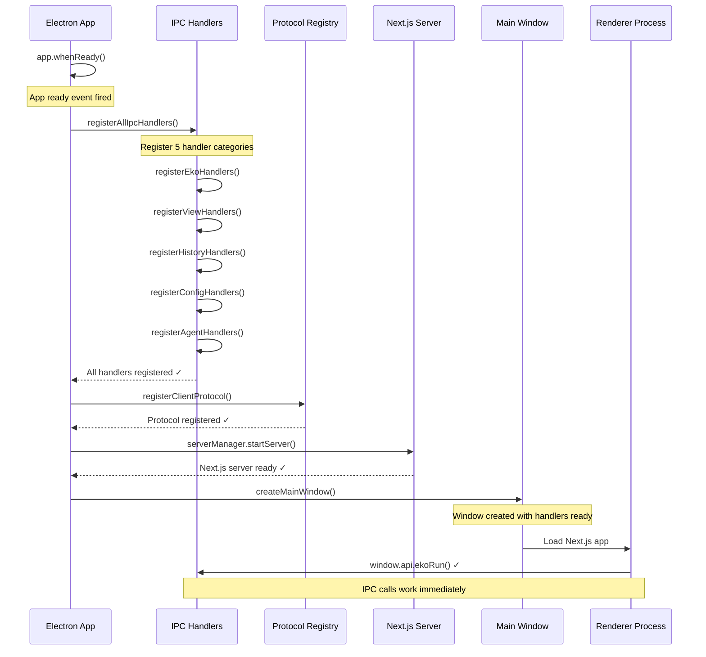
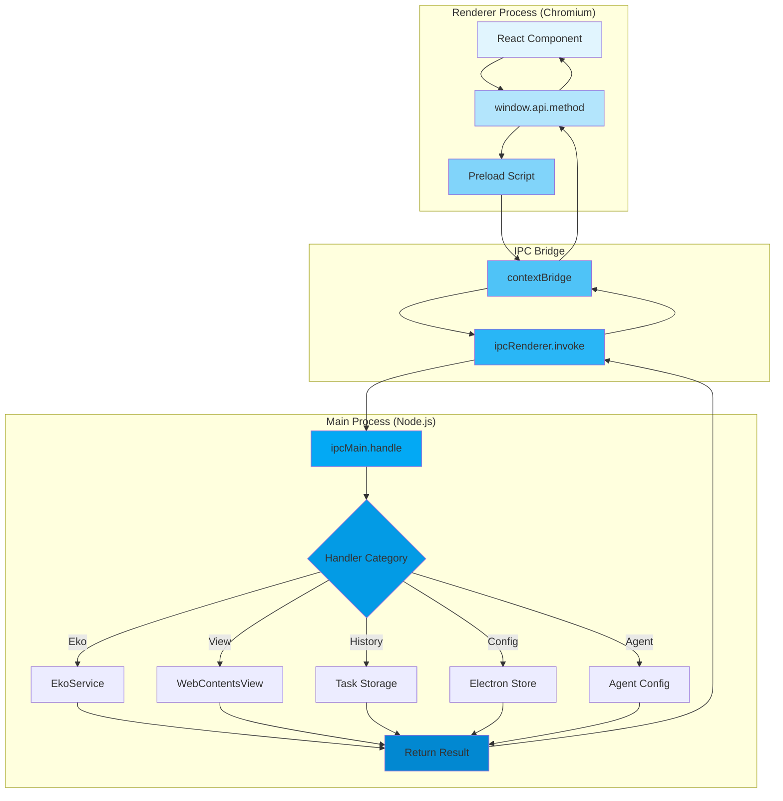
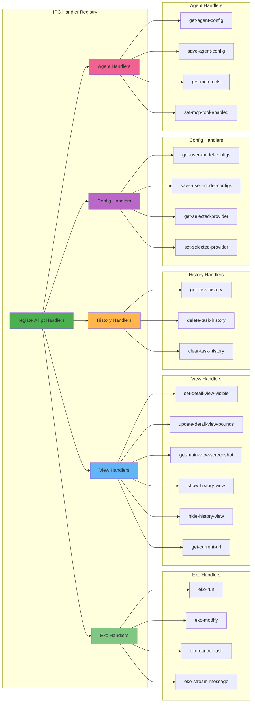
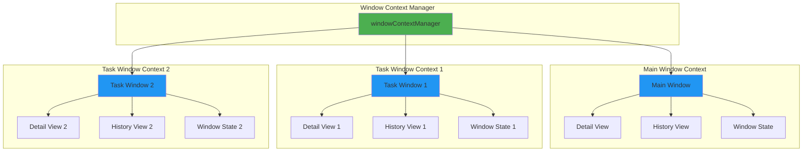
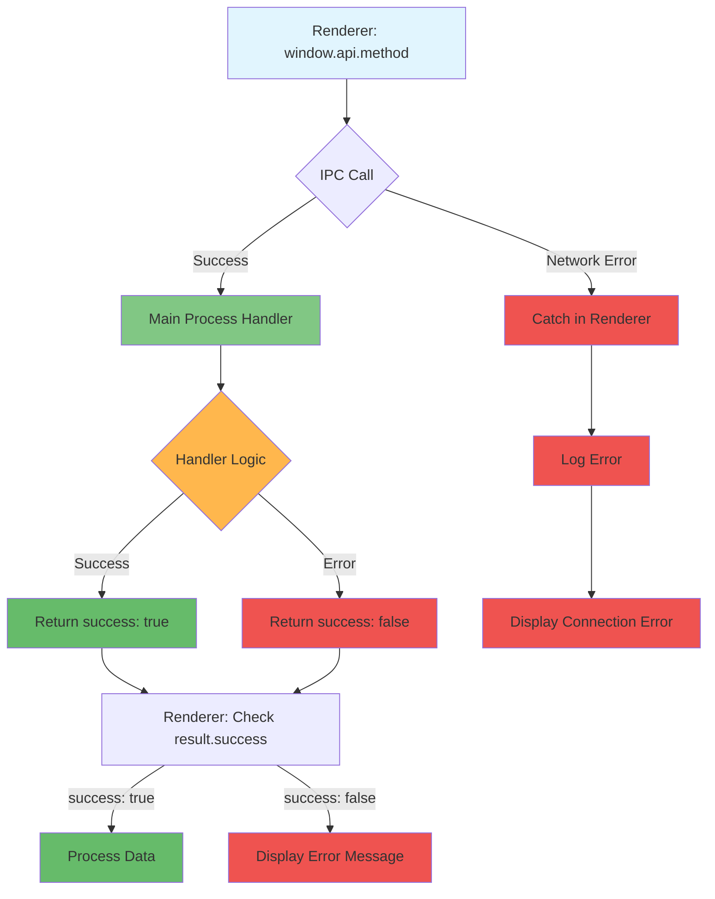
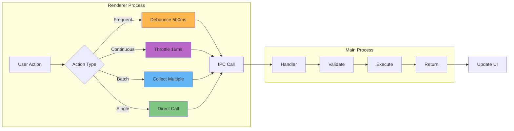
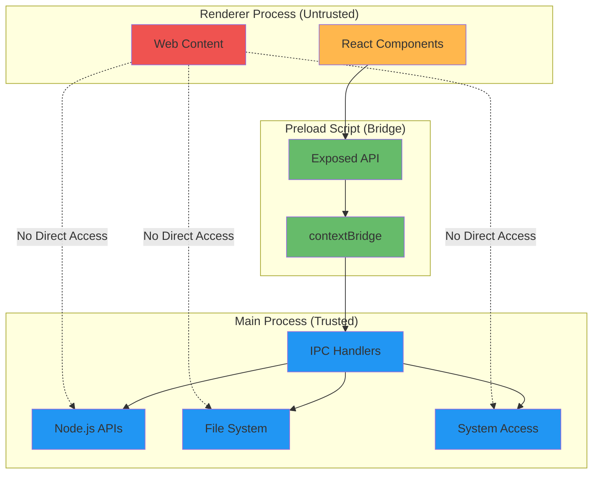
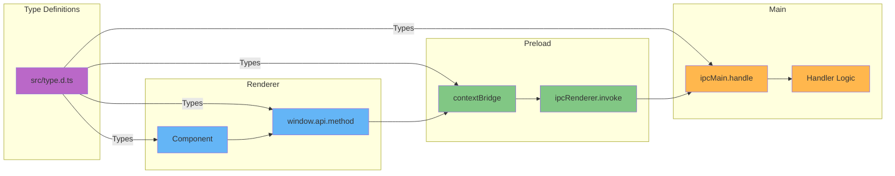
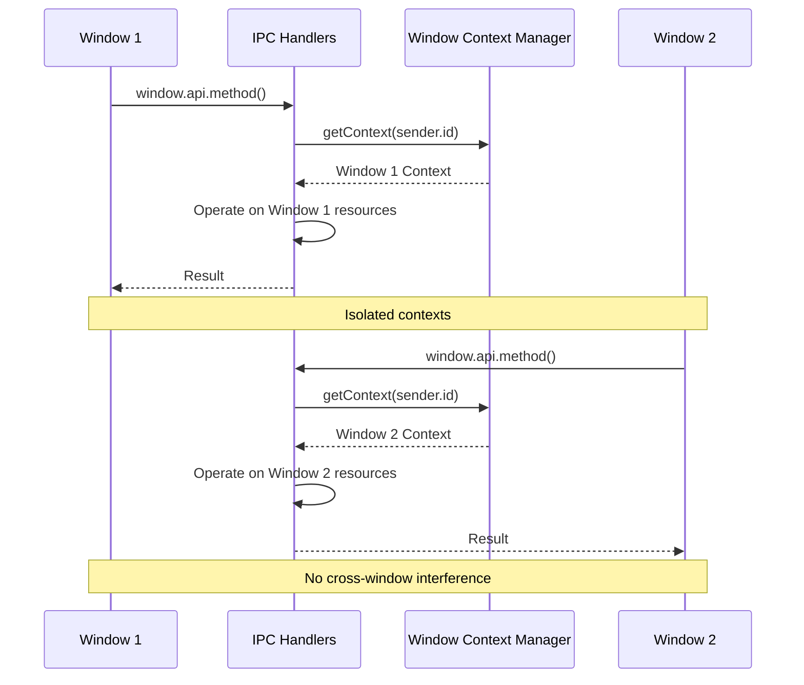
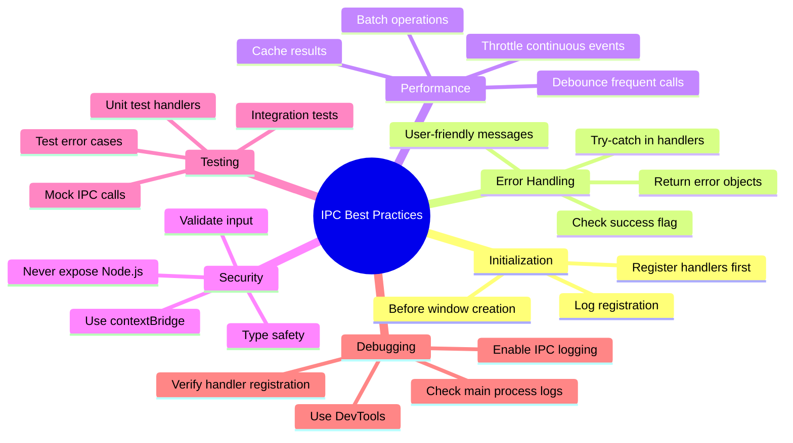

# IPC Architecture Visual Guide

This document provides visual diagrams to understand the IPC communication architecture in Manus Electron.

## Initialization Sequence



## IPC Communication Flow



## Handler Categories Architecture



## Window Context Isolation



## Error Handling Flow



## Performance Optimization Pattern



## Security Model



## Type Safety Flow



## Multi-Window Communication



## Best Practices Summary



## Quick Reference: Common Patterns

### Pattern 1: Simple IPC Call
```typescript
// Renderer
const result = await window.api.myMethod(params);
```

### Pattern 2: Error Handling
```typescript
// Renderer
try {
  const result = await window.api.myMethod(params);
  if (!result.success) {
    message.error(result.error);
    return;
  }
  // Process result.data
} catch (error) {
  console.error('IPC failed:', error);
}
```

### Pattern 3: Debounced Call
```typescript
// Renderer
const debouncedCall = useMemo(
  () => debounce((data) => {
    window.api.myMethod(data).catch(console.error);
  }, 500),
  []
);
```

### Pattern 4: Event Listener Cleanup
```typescript
// Renderer
useEffect(() => {
  const handler = (data) => console.log(data);
  window.api.onEvent(handler);
  return () => window.api.removeAllListeners('event');
}, []);
```

## Related Documentation

- [IPC System Architecture](./eko-docs/architecture/ipc-system.md) - Comprehensive guide
- [IPC Quick Reference](./IPC_QUICK_REFERENCE.md) - Quick reference for developers
- [API Documentation](./API.md) - Complete API reference
- [Architecture Changes](./ARCHITECTURE_CHANGES.md) - Change log

---

**Note**: These diagrams use Mermaid syntax and will render properly in GitHub, GitLab, and most modern markdown viewers.
