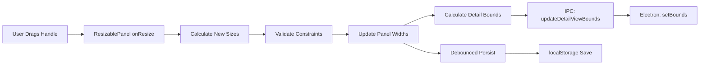
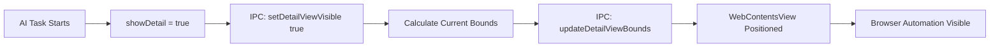

# Layout Transformation Architecture

This document describes the architecture of the resizable panel layout system and WebContentsView coordination in Manus Electron.

## Overview

The layout transformation feature implements a browser-first, edge-to-edge design with resizable panels and seamless WebContentsView coordination. This replaces the traditional header-based layout with a dynamic 75/25 split (Browser LEFT, AI Sidebar RIGHT).

## Architecture Components

### 1. Frontend Layout System

#### ResizablePanel Integration
- **Library**: `react-resizable-panels`
- **Layout**: Horizontal split with Browser Panel (LEFT) and AI Sidebar (RIGHT)
- **Default Sizes**: 75% browser, 25% AI sidebar
- **Constraints**: Browser panel 40-85%, AI sidebar 15-60%

#### Panel State Management
```typescript
interface PanelLayoutState {
  browserPanelSize: number     // Percentage (40-85)
  aiSidebarSize: number        // Percentage (15-60)
  isCollapsed: boolean         // Sidebar collapsed state
  lastModified: number         // Timestamp for cache invalidation
}
```

#### Persistence Layer
- **Storage**: localStorage with key `ai-browser-panel-layout`
- **Debouncing**: 500ms delay to avoid excessive writes
- **Validation**: Constraint checking on load and resize
- **Fallback**: Default layout when localStorage unavailable

### 2. WebContentsView Coordination

#### Bounds Calculation
The detail view bounds are calculated based on the current panel layout:

```typescript
interface DetailViewBounds {
  x: number      // Horizontal offset from window left edge
  y: number      // Vertical offset from window top
  width: number  // Calculated from AI sidebar width
  height: number // Fixed height
}

function calculateDetailViewBounds(
  windowWidth: number,
  browserPanelPercent: number,
  sidebarStartY: number = 264
): DetailViewBounds {
  const browserPanelWidth = (windowWidth * browserPanelPercent) / 100;
  const sidebarX = browserPanelWidth;
  
  return {
    x: sidebarX + 16,  // 16px left padding
    y: sidebarStartY,
    width: (windowWidth - sidebarX) - 32,  // 32px total padding
    height: 560  // Fixed height
  };
}
```

#### IPC Communication
The frontend coordinates with Electron's main process through secure IPC:

| API Method | Purpose | Parameters |
|------------|---------|------------|
| `setDetailViewVisible` | Show/hide detail view | `visible: boolean` |
| `updateDetailViewBounds` | Resize detail view | `bounds: DetailViewBounds` |
| `showHistoryView` | Display historical screenshot | `screenshotBase64: string` |
| `hideHistoryView` | Hide historical view | none |

### 3. Electron Main Process Integration

#### IPC Handler Registration Order
**Critical**: All IPC handlers are registered **before** window creation to ensure renderer processes can communicate immediately upon initialization.

```typescript
// In electron/main/index.ts
(async () => {
  await app.whenReady();
  
  // Register all IPC handlers FIRST (before creating windows)
  registerAllIpcHandlers();
  console.log('[IPC] All IPC handlers registered');
  
  // Then create windows...
  const mainWindow = await createMainWindow();
})();
```

The `registerAllIpcHandlers()` function in `electron/main/ipc/index.ts` registers:
- `registerEkoHandlers()` - AI agent task execution
- `registerViewHandlers()` - WebContentsView coordination
- `registerHistoryHandlers()` - Task history management
- `registerConfigHandlers()` - Configuration persistence
- `registerAgentHandlers()` - Agent configuration

#### WebContentsView Management

**IMPORTANT UPDATE (November 7, 2025)**: The browser view (detailView) has been repositioned to the LEFT side:

```typescript
// Current implementation in electron/main/index.ts
async function initializeMainWindow(): Promise<BrowserWindow> {
  // Create browser view (positioned on LEFT side for future layout)
  detailView = createView(`https://www.google.com`, "view", '1');
  mainWindow.contentView.addChildView(detailView);
  
  // Position browser view on the LEFT side (75% of window width by default)
  const windowBounds = mainWindow.getBounds();
  const browserWidth = Math.floor(windowBounds.width * 0.75); // 75% for browser panel
  
  detailView.setBounds({
    x: 0,                        // Left edge of window
    y: 0,                        // Top edge of window
    width: browserWidth,         // 75% of window width
    height: windowBounds.height, // Full window height
  });

  // Browser view is HIDDEN by default - only shows after first message is sent
  detailView.setVisible(false);
}

// Main process handler (registered before window creation)
ipcMain.handle('update-detail-view-bounds', async (event, bounds: DetailViewBounds) => {
  try {
    // Validate bounds
    if (bounds.width < 100 || bounds.height < 100) {
      throw new Error('Invalid bounds: minimum size is 100x100');
    }
    
    // Update WebContentsView
    detailView.setBounds({
      x: Math.max(0, bounds.x),
      y: Math.max(0, bounds.y),
      width: bounds.width,
      height: bounds.height
    });
    
    return { success: true, bounds };
  } catch (error) {
    console.error('Failed to update detail view bounds:', error);
    return { success: false, error: error.message };
  }
});
```

#### View Visibility Control
```typescript
ipcMain.handle('set-detail-view-visible', async (event, visible: boolean) => {
  try {
    detailView.setVisible(visible);
    return { success: true, visible };
  } catch (error) {
    console.error('Failed to set detail view visibility:', error);
    return { success: false, error: error.message };
  }
});
```

## Data Flow

### Panel Resize Flow


### Detail View Coordination Flow


## Performance Optimizations

### 1. GPU Acceleration
```css
.resizable-panel {
  will-change: transform;
  transition: transform 16ms ease-out;
}
```

### 2. Throttled Resize Events
```typescript
const throttledResize = throttle((sizes: number[]) => {
  handleResize(sizes);
}, 16); // 60fps target
```

### 3. Debounced Persistence
```typescript
const debouncedPersist = debounce((layout: PanelLayoutState) => {
  localStorage.setItem('ai-browser-panel-layout', JSON.stringify(layout));
}, 500);
```

### 4. Batched DOM Operations
```typescript
// Read phase
const bounds = calculateDetailViewBounds(window.innerWidth, browserSize);

// Write phase (asynchronous, no layout thrashing)
window.api.updateDetailViewBounds(bounds);
```

## Error Handling Strategy

### 1. Graceful Degradation
- **localStorage unavailable**: Use default layout without persistence
- **IPC failures**: Log errors, continue with current state
- **Constraint violations**: Clamp to valid ranges

### 2. Error Recovery
```typescript
const handleResize = (sizes: number[]) => {
  try {
    const [browserSize, sidebarSize] = sizes;
    
    // Validate constraints
    if (browserSize < 40 || browserSize > 85) {
      const clampedSize = Math.min(Math.max(browserSize, 40), 85);
      setLayout({ browserPanelSize: clampedSize, aiSidebarSize: 100 - clampedSize });
      return;
    }
    
    // Normal processing...
  } catch (error) {
    console.error('Resize handler error:', error);
    // Reset to default layout
    setLayout({ browserPanelSize: 75, aiSidebarSize: 25 });
  }
};
```

## Responsive Behavior

### Desktop (≥1024px)
- Horizontal split layout
- Resizable panels with drag handle
- Full WebContentsView coordination

### Tablet (<1024px)
- Vertical stack layout
- Browser panel: 60vh
- AI sidebar: 40vh
- Horizontal resize handle

### Mobile (<640px)
- Vertical stack layout
- Equal 50vh split
- Touch-optimized resize handle

## Accessibility Features

### Keyboard Navigation
- **Tab**: Focus resize handle
- **Arrow Left/Right**: Adjust panel sizes by 5%
- **Home/End**: Set to min/max sizes
- **Escape**: Reset to default layout

### Screen Reader Support
- ARIA labels for all interactive elements
- Role attributes for resize handle
- Value announcements for size changes

### Focus Management
```css
.resize-handle:focus {
  outline: 2px solid var(--interactive-default);
  outline-offset: 0;
  z-index: 10;
}
```

## Integration Points

### 1. Component Integration
- **AISidebarHeader**: Relocated header functionality
- **DetailPanel**: WebContentsView placeholder
- **MessageList**: Tool history with screenshot previews
- **HistoryPanel**: Historical screenshot display

### 2. State Management
- **Panel Layout**: localStorage persistence
- **Detail View**: Visibility and bounds coordination
- **History Mode**: Read-only message display

### 3. IPC Handlers
- **Main Process**: WebContentsView management
- **Preload Script**: Secure API exposure
- **Renderer Process**: React component integration

## Testing Strategy

### Unit Tests
- Panel constraint validation
- Bounds calculation accuracy
- Error handling scenarios

### Integration Tests
- IPC communication flow
- WebContentsView positioning
- Layout persistence

### Performance Tests
- 60fps resize validation
- Memory usage monitoring
- CPU profiling during interactions

## Future Enhancements

### Planned Features
1. **Multi-Monitor Support**: Bounds calculation for external displays
2. **Layout Presets**: Saved layout configurations
3. **Gesture Support**: Touch gestures for mobile resize
4. **Animation Improvements**: Smooth collapse/expand transitions

### Technical Debt
1. **Type Safety**: Strengthen IPC type definitions
2. **Error Boundaries**: React error boundaries for layout failures
3. **Performance Monitoring**: Real-time performance metrics
4. **Accessibility Audit**: WCAG AA compliance verification